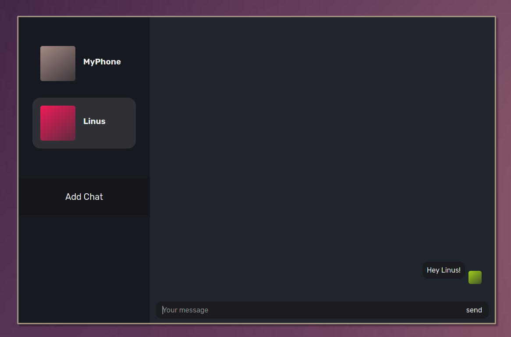

# Rabbit Hole 🕳️
A minimalistic frontend for Hole chat. 
It's just a demonstration of how app working on top of [hole-core](https://github.com/hole-chat/core) may look like. 




# Depend by platform is better ‼️
The purpose of "hole project" is to **write independend frontend clients for each platform**, because, **app cannot be good for one particular platform if it's multiplatform**. 
As a [hole-core](https://github.com/hole-chat/core) *is just a logic part*, which should be multiplatform, frontend shouldn't, And I urge you to help and write "rabbit-hole for android" or "rabbit-hole-gtk", e.t.c. 


## CLI Commands 💻
``` bash
# install dependencies
npm install

# serve with hot reload at localhost:8080
npm run dev

# build for production with minification
npm run build

# test the production build locally
npm run serve

# run tests with jest and enzyme
npm run test
```
